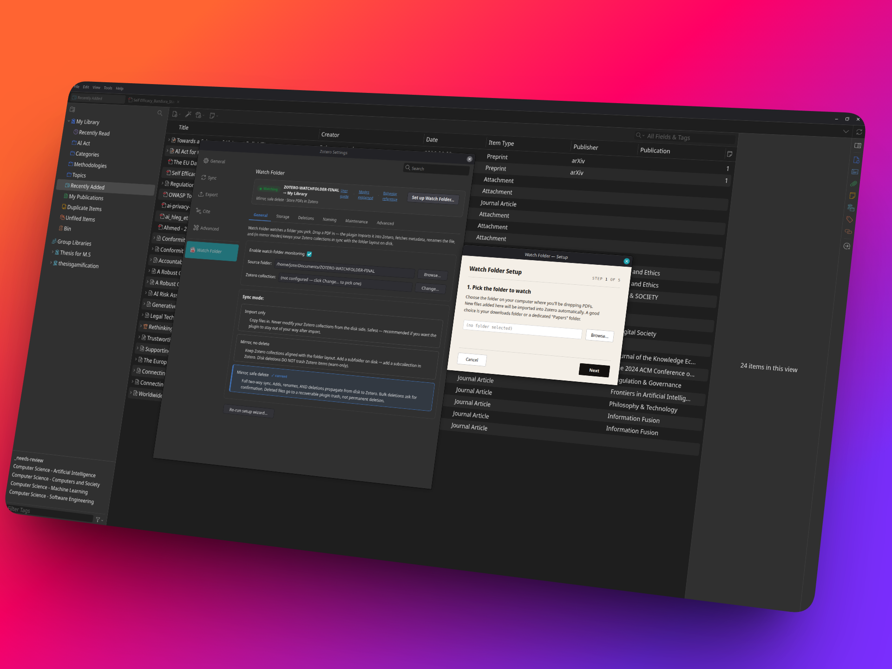

# Zotero Watch Folder

[](https://www.zotero.org)
[](https://github.com/josesiqueira/zotero-watch-folder/releases/latest)
[](https://github.com/josesiqueira/zotero-watch-folder/releases)
[](LICENSE)
[](https://github.com/josesiqueira/zotero-watch-folder/issues)
[](https://josesiqueira.github.io/zotero-watch-folder/)

<div align=center></img></div>

**A watch folder for Zotero 7, 8, and 9.** Drop a PDF into a folder on your computer, and it shows up in Zotero a few seconds later, with its metadata filled in and a tidy filename. No dragging, no clicking, no manual import.

Point the plugin at a folder, pick the Zotero collection it belongs to, and you're done. If you like, it can also keep your folders and your Zotero collections mirrored — so the way you organise things on disk and the way you organise them in Zotero stay in step.

**[Open the user guide →](https://josesiqueira.github.io/zotero-watch-folder/)** — a friendly walkthrough, a full settings reference, and answers to common questions. The same guide ships inside the plugin and opens from the settings pane.

Works with **Zotero 7, 8, and 9**. Live-verified on the latest Zotero 9.

## Outline

[What is this?](#what-is-this)

[What can it do?](#what-can-it-do)

[Before you start](#before-you-start)

[Install](#install)

[Quick start](#quick-start)

<details style="text-indent: 2em">
<summary>More</summary>

[Pick how hands-on it is: three modes](#pick-how-hands-on-it-is-three-modes)

[Where your PDFs live: storage strategy](#where-your-pdfs-live-storage-strategy)

[Reaching your phone & other computers](#reaching-your-phone--other-computers)

[When something looks off](#when-something-looks-off)

</details>

[Development](#development)

[Status & roadmap](#status--roadmap)

[Disclaimer](#disclaimer)

[Contributors](#contributors)

[License](#license)

## What is this?

Zotero Watch Folder is a plugin for [Zotero](https://zotero.org).

It turns a plain folder on your disk into an **inbox for your library**: anything you save there is pulled into Zotero automatically, organised, and (optionally) kept in two-way sync with your collections.

It is built to be:

- **Safe by default** — out of the box it only ever *adds* things; nothing is moved or deleted until you opt in.
- **Recoverable** — even in the delete-capable mode, removed files go to a recoverable trash, never a permanent erase.
- **Out of your way** — set it once; new files just appear in Zotero.
- **All local** — the plugin runs on your computer; your existing Zotero sync carries things to your other devices.

## What can it do?

- **Auto-import PDFs from a watched folder** — drop a file in, it becomes a Zotero item within seconds, metadata looked up and filename cleaned up (e.g. `Smith - 2021 - A Great Paper.pdf`). [Learn more →](#quick-start)
- **Mirror folders and Zotero collections** — make a subfolder, get a subcollection; rename one, the other follows. Two-way, optional. [Learn more →](#pick-how-hands-on-it-is-three-modes)
- **Never make duplicates** — save the same paper twice and it's recognised by content hash and skipped.
- **Delete safely** — in the delete-capable mode, removals go to a recoverable trash inside your folder and can be put back; large deletions ask first; an edited file is never silently overwritten. [Learn more →](#pick-how-hands-on-it-is-three-modes)
- **Choose where your PDFs live** — store them in Zotero (synced everywhere), link them from your folder (saves Zotero storage), or both. Works great with WebDAV / cloud file sync. [Learn more →](#where-your-pdfs-live-storage-strategy)
- **Smart rules** — match on title / author / DOI / tags / filename and auto-tag, file into a collection, or skip.
- **Won't run away with your library** — it pauses if the folder goes missing (e.g. an unplugged drive) instead of treating "everything vanished" as "delete everything." [Learn more →](#when-something-looks-off)

## Before you start

> [!WARNING]
> **Back up your folder and your Zotero library before you turn this on.**
>
> Depending on the mode you choose, this plugin can **rename, move, and even delete files on your disk** to keep your folder and Zotero in step, and create or rename **Zotero collections** to match your folders. That's the whole point — but a wrong setting on a folder full of papers you care about can ruin your day.
>
> Two minutes of insurance:
> - **Copy your folder somewhere safe** (a backup drive, a cloud snapshot — anything).
> - **Back up your Zotero library** — make sure Zotero Sync is up to date, or `File → Export Library… → Zotero RDF`.
> - **Start in Mode 1 (Import only).** It only ever *adds*. Get a feel for it before trying the mirror modes.
>
> Mode 3 keeps a recoverable trash so most mistakes can be undone — but a backup is still what lets you sleep at night.

## Install

1. Download the latest `.xpi` from the **[Releases page](https://github.com/josesiqueira/zotero-watch-folder/releases/latest)**.
   - *Firefox users:* right-click the `.xpi` → **Save link as…** (so it isn't opened as an extension by the browser).
2. In Zotero, open **Tools → Plugins**.
3. Click the gear icon → **Install Add-on From File…**
4. Choose the `.xpi` and restart Zotero if asked.
5. Open **Edit → Settings → Watch Folder** (on macOS: **Zotero → Settings**) and click **Set up Watch Folder…**.

New releases install themselves automatically through Zotero from then on.

## Quick start

Get going in about **2 minutes**:

1. **Run the setup wizard** (Settings → Watch Folder → *Set up Watch Folder…*). It walks you through four choices:
   - **Watch folder** — the local folder you'll drop PDFs into.
   - **Sync root** — the Zotero collection everything anchors to.
   - **Mode** — start with **Import only** (see below).
   - **PDF storage** — start with **Store PDFs in Zotero** (the default).
2. **Turn it on.**
3. **Drop a PDF** into your watch folder. Within a few seconds it appears in your sync-root collection — metadata fetched, filename templated. That's it.

> The watch folder is just an **inbox**. You don't have to keep files there; in the default "stored" setup Zotero takes its own copy on import.

### Pick how hands-on it is: three modes

You choose a mode during setup and can switch any time from the settings — no restart needed.

| Mode | What it does | Who it's for |
|---|---|---|
| **Mode 1 — Import only** | New files get imported. Nothing is ever moved or deleted. The safest option. | Most people. **Start here.** |
| **Mode 2 — Mirror, no deleting** | Folders and Zotero collections mirror each other both ways; renames and moves follow along. Deletions are only flagged, never carried out. | People who organise in folders and want Zotero to match. |
| **Mode 3 — Mirror with safe delete** | Full two-way sync, including deletions — but deleted files go to a recoverable trash, and big deletions ask first. | People who want their folder and Zotero to be exact mirrors. |

### Where your PDFs live: storage strategy

This is a separate dial from the mode — it decides where the **PDF bytes** sit, which controls your Zotero storage quota and whether files reach your phone.

| Strategy | What it does | Best for |
|---|---|---|
| **Store PDFs in Zotero** *(default)* | Zotero keeps the file and syncs it (via Zotero Storage **or** WebDAV). | Most people, and **anyone using WebDAV / cloud file sync** — it's the option that reaches every device, including mobile. |
| **Link PDFs from watch folder** | Zotero points at the file in your folder; no copy. Saves Zotero storage. | A single-machine setup where you back the folder up yourself. Linked files are **not** uploaded to mobile. |
| **Store in Zotero and mirror to folder** | A stored copy that syncs **and** a browsable local copy. | Backup / export workflows. |

> Quota full? Two ways out: point Zotero's **file sync at WebDAV** (pCloud, Nextcloud, a NAS…) and keep "stored" — files still sync, just to a cheaper cloud; **or** switch to **linked** and let the folder live on your own backup. See the [architecture doc](docs/architecture.md#5-the-cloud-layer-provider-agnostic-where-bytes-live--how-they-sync) for the full picture.

### Reaching your phone & other computers

The plugin works on **your computer**. What reaches your phone is whatever **Zotero's own sync** carries:

- **Item info** (titles, authors, collections, notes, **annotations**) always syncs — free and unlimited — so you'll see your papers everywhere.
- **PDF files** sync only if they're **stored** (Zotero Storage or your WebDAV server). **Linked** files stay on the computer and won't open on mobile.

To add files *from* another device, use Zotero normally there (the watch folder is desktop-only); sync carries them back. Configure WebDAV on each device separately if you use it.

### When something looks off

The settings pane surfaces anything needing attention — suppressed items, conflicts, sync warnings, and a "restore trashed folders" option — each with a button to resolve it. If the watch folder becomes unreachable (unplugged drive, cloud eviction), the plugin **pauses** rather than mistaking "everything missing" for "delete everything." The [user guide](https://josesiqueira.github.io/zotero-watch-folder/) has a whole chapter on this.

## Development

Plain ES modules bundled with esbuild — no framework, no heavy toolchain.

```bash
git clone https://github.com/josesiqueira/zotero-watch-folder.git
cd zotero-watch-folder
npm install
npm run build && npm run bundle   # produces dist/ + the runnable bundle
npm run package                   # zips the .xpi + writes update.json
npm test                          # Vitest unit suite
```

The esbuild bundle (`dist/content/scripts/watchFolder.js`) is **what Zotero runs** — editing a `.mjs` does nothing until you re-bundle. Full architecture, the build pipeline, every preference, and the test layout are in **[docs/DEVELOPERS.md](docs/DEVELOPERS.md)**; the visual architecture (layers, the mode × storage dials, the provider-agnostic WebDAV/cloud layer, runtime diagrams) is in **[docs/architecture.md](docs/architecture.md)**.

> Working on the code with an AI agent? Read [`CLAUDE.md`](CLAUDE.md) first — it holds the load-bearing invariants and "don't touch without understanding" notes.

## Status & roadmap

- Mode 1 import, Mode 2 mirror, Mode 3 safe-delete + recoverable trash + restore
- Content-hash dedup, metadata retrieval, template rename, smart rules
- PDF storage strategy (stored / linked / mirror) + "Reclaim Zotero Storage" tool
- Drive-disconnect safety, bulk-delete confirmation, conflict gates
- *Next:* broader Windows / macOS field-testing

The full behaviour spec lives in the [test-cases page](https://josesiqueira.github.io/zotero-watch-folder/test-cases.html) (every inclusion/exclusion the plugin acts on).

## Disclaimer

Use this code under GPL-3.0. No warranties are provided. It can move and delete files on your disk by design — keep a backup, and keep the laws of your locality in mind.

## Contributors

Bugs and ideas are welcome at **[github.com/josesiqueira/zotero-watch-folder/issues](https://github.com/josesiqueira/zotero-watch-folder/issues)**. Run `npm test` before opening a PR and add a unit test next to any module you change — the suite enforces a strict no-skipped-tests rule.

Thanks to everyone who has contributed:

<a href="https://github.com/josesiqueira/zotero-watch-folder/graphs/contributors">
  
</a>

## License

GNU GPL v3.0 — free and open source. See [`LICENSE`](LICENSE) for the full text.

---

*Building from source or curious how it works under the hood? See **[docs/DEVELOPERS.md](docs/DEVELOPERS.md)** and the visual **[docs/architecture.md](docs/architecture.md)**.*
