# Architecture — how the whole thing fits together

A visual map of Zotero Watch Folder: the layers, the two independent dials (sync **mode** × PDF **storage strategy**), every runtime scenario, and — the part most people get confused by — **where your PDF bytes actually live and how they reach your other devices**, including WebDAV and any cloud provider.

> Diagrams are [Mermaid](https://mermaid.js.org/). They render in VS Code (with a Mermaid extension), Obsidian, most Markdown previewers, and GitHub. If you're reading raw text, each diagram is followed by prose that says the same thing.
>
> **See also** [DEVELOPERS.md](DEVELOPERS.md) for the build pipeline, the full preference list, and the test layout.

## Contents

1. [The one big idea: three independent layers](#1-the-one-big-idea-three-independent-layers)
2. [Layered architecture diagram](#2-layered-architecture-diagram)
3. [Dial 1 — sync modes](#3-dial-1--sync-modes)
4. [Dial 2 — PDF storage strategy](#4-dial-2--pdf-storage-strategy)
5. [The cloud layer (provider-agnostic): where bytes live & how they sync](#5-the-cloud-layer-provider-agnostic-where-bytes-live--how-they-sync)
6. [Scenario walkthroughs](#6-scenario-walkthroughs)
7. [Module map](#7-module-map)
8. [Safety gates & invariants](#8-safety-gates--invariants)
9. [The tracking store](#9-the-tracking-store)
10. [Platform reference (Zotero 7/8/9)](#10-platform-reference-zotero-789)

---

## 1. The one big idea: three independent layers

Almost every "wait, what does this do?" question dissolves once you see that **three different layers are doing three different jobs**, and they don't depend on each other:

| Layer | Question it answers | Who owns it |
|---|---|---|
| **The plugin** | How do PDFs get *into* Zotero, and how do disk folders and Zotero collections stay *organized* relative to each other? | This plugin |
| **PDF storage strategy** | *Where do the PDF bytes physically live* — inside Zotero's storage, or out in your watch folder? | This plugin (the `pdfStorageStrategy` pref) |
| **The cloud layer** | How do the bytes (and the metadata) reach your *other devices*, and what costs storage? | **Zotero's own sync**, plus whatever cloud/folder-sync tool you use |

The plugin sits on top of Zotero; Zotero's sync sits below the plugin. The plugin never uploads anything to a cloud itself — that's always Zotero's file sync, or a folder-sync tool you run separately. Keep that separation in mind and the rest follows.

Two of these are **dials you set independently**:

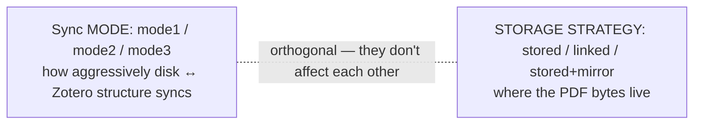

You can run *mode 3 + stored*, *mode 1 + linked*, *mode 2 + stored+mirror* — all 9 combinations are legal. Mode is about **structure/organization sync**; storage strategy is about **byte location**.

---

## 2. Layered architecture diagram

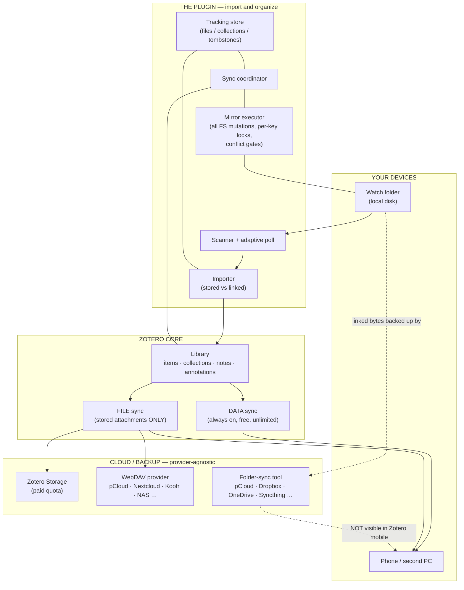

Reading it top to bottom: files land in your **watch folder** → the **plugin** scans, imports, and (in mode 2/3) keeps disk folders and Zotero collections mirrored → everything becomes part of the **Zotero library** → Zotero's **data sync** always carries metadata/notes/annotations for free, while Zotero's **file sync** carries the *stored* PDF bytes to either **Zotero Storage** or a **WebDAV provider** → your **phone** sees whatever data sync + file sync deliver. Linked PDFs skip Zotero file sync entirely; their bytes only travel if the watch folder itself sits on a folder-sync tool — and even then they don't appear in the Zotero mobile apps.

---

## 3. Dial 1 — sync modes

Mode controls **how changes to structure propagate between disk and Zotero** — and how destructive that propagation is allowed to be.

| Mode | Name | Disk → Zotero | Zotero → Disk | Deletes? |
|---|---|---|---|---|
| **mode1** | Import only | New PDFs imported | nothing | Never touches anything after import |
| **mode2** | Mirror, no delete | New PDFs + new subfolders → collections | New collections → subfolders; renames | **Never deletes** — a vanished file/collection is *suppressed/warned*, not trashed |
| **mode3** | Mirror, safe delete | Full two-way: adds, renames, **and deletes** | Full two-way: adds, renames, **and deletes** | Yes — but everything goes to **recoverable trash**, never hard-deleted, and behind conflict gates |

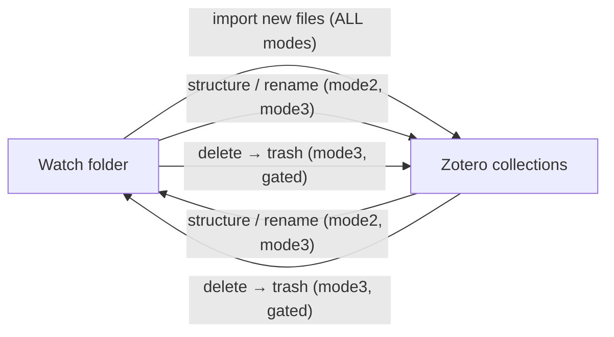

Key point: **deletion is direction-split** and never symmetric-by-accident. A deleted Zotero collection trashes the *local folder*; a deleted local folder propagates to *Zotero* — two separate code paths, each with its own safety gate (see [§8](#8-safety-gates--invariants)).

---

## 4. Dial 2 — PDF storage strategy

Storage strategy controls **where the PDF bytes physically live** (the `pdfStorageStrategy` pref). This is the dial that decides whether files count against your Zotero quota and whether they can reach your phone.

| Strategy | UI label | On import | Bytes live in | Conversion tool |
|---|---|---|---|---|
| `stored` | Store PDFs in Zotero | `importFromFile` — Zotero copies the bytes into its storage | Zotero's `storage/` (and whatever file-sync backend you use) | — |
| `linked_watch_folder` | Link PDFs from watch folder | `linkFromFile` — Zotero just points at the file; no copy | Your watch folder only | **Reclaim Zotero Storage** (converts stored → linked, hash-verified, skips annotated) |
| `stored_plus_mirror` | Store in Zotero **and** mirror to watch folder | `importFromFile` **and** keep the watch-folder copy | Both: Zotero storage **and** a local mirror | **Build/Repair Mirror** |

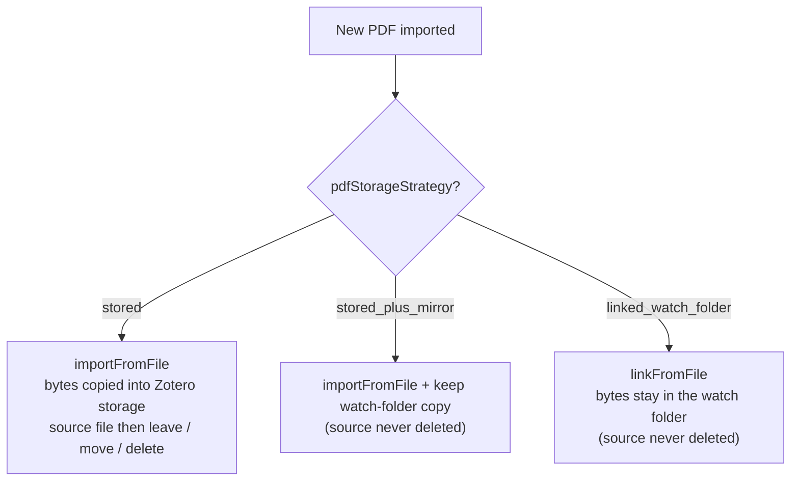

The only place this dial and Zotero's sync interact: **Zotero file sync only carries *stored* attachments.** Linked PDFs are invisible to it. That single fact drives the whole next section.

---

## 5. The cloud layer (provider-agnostic): where bytes live & how they sync

### Zotero's sync has two halves

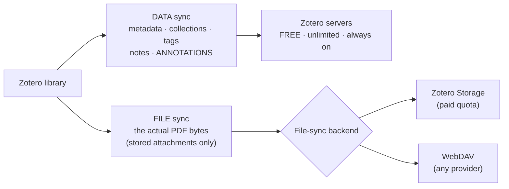

- **Data sync** (metadata, collections, tags, notes, **annotations**) always goes through Zotero's servers, is free and unlimited, and **never counts against your storage quota**. Your highlights live here — not in the PDF file.
- **File sync** is the only part that consumes storage, and it has a backend you choose: **Zotero Storage** *or* **WebDAV**.

### WebDAV is provider-agnostic — it's just a protocol

WebDAV is built into Zotero (Settings → Sync → File Syncing → WebDAV). You give it a **URL + username + password**; Zotero speaks the protocol to *any* WebDAV-compatible server. The plugin is not involved at all.

| Provider type | Examples | Works with Zotero WebDAV? |
|---|---|---|
| Native WebDAV | **pCloud** (`webdav.pcloud.com` / EU `ewebdav.pcloud.com`), Nextcloud / ownCloud, Koofr, Infomaniak kDrive, Box, a NAS (Synology/QNAP) | Yes — URL + login, done |
| No native WebDAV | Google Drive, Dropbox, OneDrive, iCloud | Only via a separate WebDAV-bridge gateway (extra moving part) |

> The plugin treats the watch folder the same way: it's just a directory on disk. It makes **no assumption** about whether that directory is local, a NAS mount, or a cloud-sync folder — so the linked strategy is equally provider-agnostic.

### The decision matrix (the part worth printing out)

This is what actually answers "does it cost Zotero quota?" and "will it show up on my phone?":

| Strategy + backend | Bytes reach other devices via | Counts vs Zotero quota | Shows in Zotero **mobile**? | Who backs up the bytes |
|---|---|---|---|---|
| **stored** + Zotero Storage | Zotero file sync | **Yes** | Yes | Zotero |
| **stored** + WebDAV *(any provider)* | Zotero file sync → your WebDAV server | **No** | Yes | Your WebDAV provider |
| **linked_watch_folder** + folder-sync tool *(any)* | the folder-sync tool, outside Zotero | **No** | **No** (linked files aren't synced to mobile) | Your folder-sync tool — **you own this** |
| **stored_plus_mirror** + Zotero Storage | Zotero file sync (+ a local mirror copy) | **Yes** | Yes | Zotero + local mirror |
| **stored_plus_mirror** + WebDAV | Zotero file sync → WebDAV (+ local mirror) | **No** | Yes | WebDAV provider + local mirror |

Two routes free your Zotero quota, in opposite philosophies:

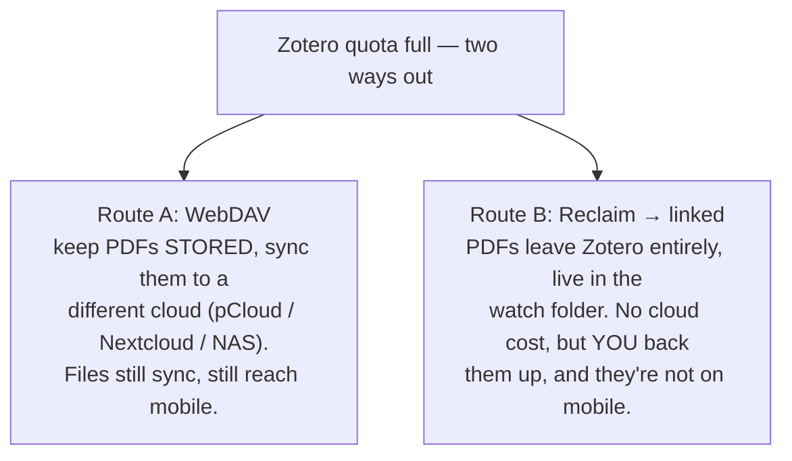

- **Route A (WebDAV)** = "different cloud, still fully synced." Best when you want files on your phone and across machines without paying Zotero.
- **Route B (linked / the plugin's Reclaim tool)** = "local only, you own the backup." Best for a single-machine setup with no cloud cost.

They're alternatives — pick one. If you go WebDAV, run the plugin in `stored` (or `stored_plus_mirror`) and don't use Reclaim; Reclaim's linked files would *not* sync over WebDAV.

> Caveats that bite people: (1) switching to WebDAV doesn't auto-delete what's already in Zotero Storage — purge it (zotero.org → Storage, or *Reset File Sync History*) or the meter won't drop. (2) WebDAV only covers **My Library**; **group-library** files always use Zotero Storage.

---

## 6. Scenario walkthroughs

### 6.1 New PDF dropped → import

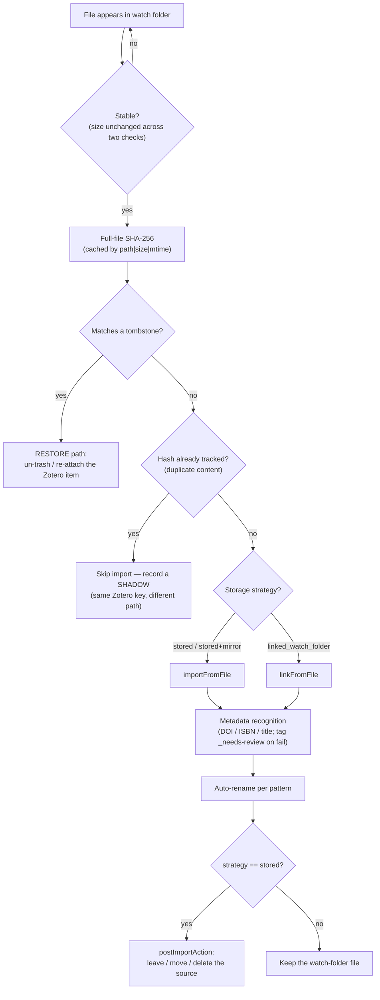

Dedup is **hash-first** (exact content), with DOI/ISBN/title checks gated to *after* metadata is known. Tombstones (deleted-but-recoverable items) are consulted *before* dedup so re-adding a file you trashed restores it instead of making a fresh copy.

### 6.2 The three modes reacting to a change

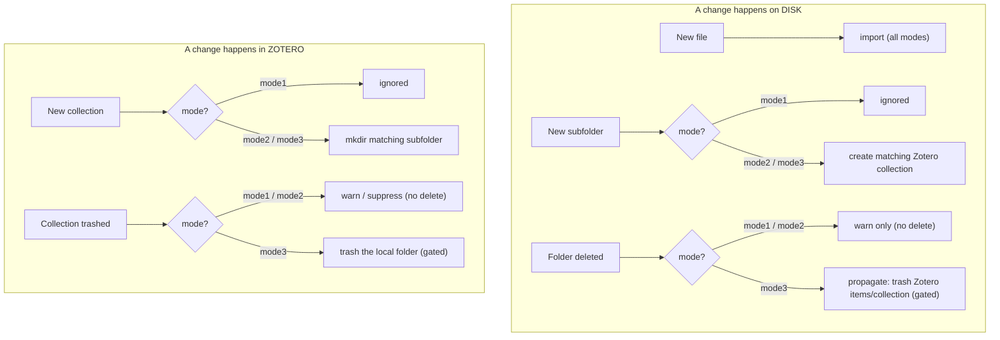

### 6.3 Deletion / trash (mode 3, the only mode that deletes)

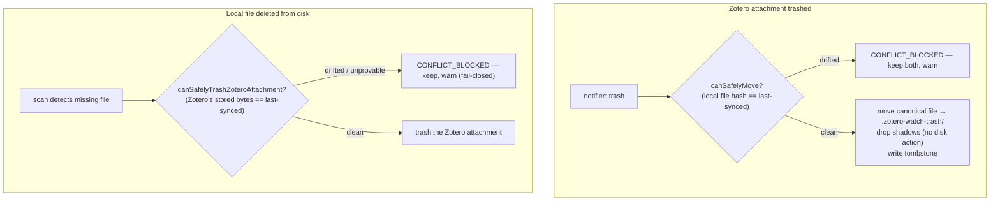

Both directions are guarded so a file edited on one side is never silently destroyed because of a delete on the other. Mode 2 reaches these paths too but is **warn-only**: instead of deleting, it flips the record to *suppressed* so the next scan doesn't re-import it (avoids a re-import loop).

### 6.4 Restore (tombstones)

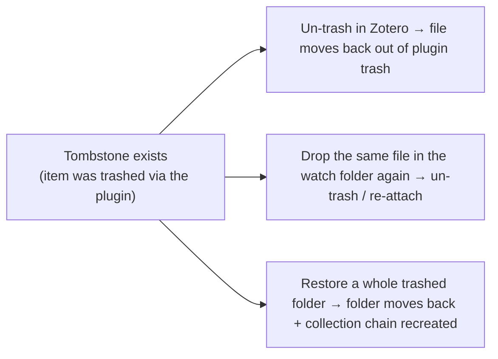

### 6.5 Baseline (first run for a sync root)

When you enable mode 2/3 on a sync root, a one-time reconcile runs (idempotent, keyed on a pref): copy stored attachments to their canonical disk paths, create empty subfolders for existing subcollections, and hash-match existing disk files to avoid duplicating. After baseline completes, late-added items get adopted into scope individually.

### 6.6 Reclaim storage (stored → linked) — conservative & recoverable

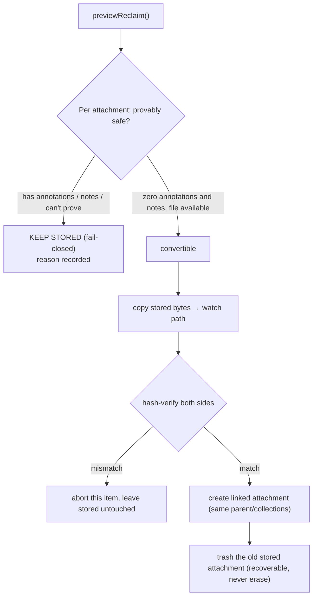

The classifier **fails closed**: anything it can't prove is annotation-free and note-free stays stored. The original is trashed (recoverable), not hard-deleted. This is the in-app counterpart to "Route B" above.

### 6.7 Multi-device — how a paper reaches your phone

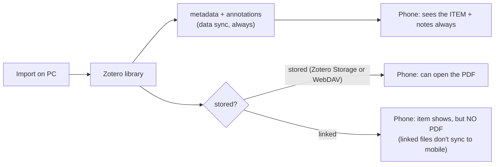

So: on your phone you **always** see the item, its metadata, and your annotations (data sync). Whether you can **open the PDF** depends on the storage strategy — *stored* (via Zotero Storage or WebDAV) → yes; *linked* → no.

---

## 7. Module map

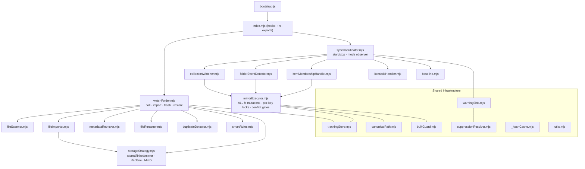

| Module | Role |
|---|---|
| `watchFolder.mjs` | Poll loop, import pipeline, Zotero-trash/restore handling |
| `syncCoordinator.mjs` | Wires mode 2/3 components; runtime mode-pref observer |
| `collectionWatcher.mjs` | Zotero notifier (`collection`, `collection-item`) → mirror actions |
| `folderEventDetector.mjs` | Disk-side diff → folder-deleted/renamed events |
| `itemMembershipHandler.mjs` | `collection-item` add/remove → canonical recompute |
| `mirrorExecutor.mjs` | **Single FS-mutation bottleneck**; per-key locks; conflict gates; cross-FS fallback |
| `storageStrategy.mjs` | Resolves stored/linked/mirror; Reclaim + Build/Repair Mirror engines |
| `baseline.mjs` | First-run reconcile for a sync root |
| `trackingStore.mjs` | Persisted file/collection/tombstone records + indexes |
| `canonicalPath.mjs` | Sync-root scoping, collection ↔ relative-path translation |
| `bulkGuard.mjs` | "More than N / X% affected?" confirmation before bulk deletes |
| `warningSink` / `suppressionResolver` | In-memory warnings + the prefs-pane resolution UX |
| `duplicateDetector` / `metadataRetriever` / `fileRenamer` / `smartRules` | Import-pipeline helpers |

---

## 8. Safety gates & invariants

These are the load-bearing rules that keep "sync" from meaning "lose data":

- **Sync-root scoping.** The plugin only ever touches the chosen sync-root collection and everything *below* it. Walks are downward from the root; special collections (Trash, Duplicates, Unfiled, My Publications, saved searches) are filtered out.
- **Two deletion conflict gates** (mode 3):
  - `canSafelyMove` — local-hash gate. Zotero→local deletions refuse if the local file was edited (→ CONFLICT_BLOCKED).
  - `canSafelyTrashZoteroAttachment` — Zotero-freshness gate, **fail-closed**. Local→Zotero deletions refuse if the stored bytes changed *or can't be verified*.
- **Suppress-not-drop.** When a record's file still exists, mode 2 (and mode-3 "never"-delete) flips it to *suppressed* rather than dropping tracking — a dropped record + a present file = re-import loop.
- **Canonical vs shadow records.** Two copies of the same file under the root share one Zotero key; only the canonical path is ever disk-deleted. Shadows are dropped from tracking without touching disk.
- **Recoverable trash.** Mode-3 deletes move into `.zotero-watch-trash/` (or OS trash), never hard-delete; that dir is excluded from scanning so trashed files aren't re-imported.
- **One mutation bottleneck.** Every filesystem mutation goes through `mirrorExecutor` behind per-key (`collection:<key>` / `attachment:<key>`) promise-chain locks. No global lock, no bypass.
- **Bulk guard.** Deletes affecting more than 10 items *or* more than 20% of tracked items require explicit confirmation; declining demotes to a non-destructive "mark missing."

---

## 9. The tracking store

Persisted as `zotero-watch-folder-tracking-v2.json` in Zotero's data directory. Three discriminated record types:

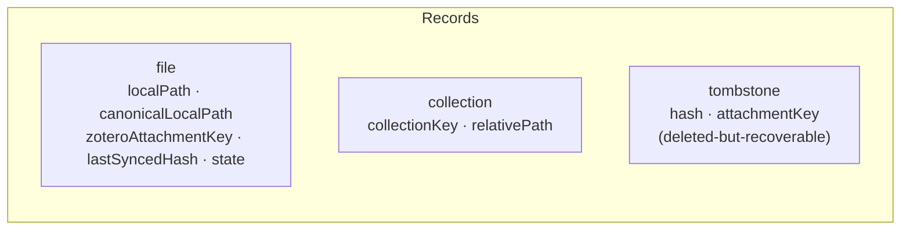

- Identity is by **Zotero attachment/collection KEY** (8-char, library-stable), never numeric itemIDs.
- `state` (frozen enum) drives behavior: `clean`, `dirty`, `pending*`, `external-edit`, `CONFLICT_BLOCKED`, `OUT_OF_SCOPE_SUPPRESSED`, `USER_DETACHED`, etc.
- The hash-dedup index includes only *syncing* states — detached/suppressed/conflicted records deliberately can't satisfy dedup, so a file you chose to stop syncing won't silently re-link.
- Tombstones aren't in the dedup index but are queried *before* dedup so restores beat re-imports.

---

## 10. Platform reference (Zotero 7/8/9)

The plugin is a **bootstrapped Zotero add-on** — a `.xpi` (zip) holding `manifest.json`, `bootstrap.js`, `prefs.js`, `content/`, and `locale/<lang>/*.ftl`. `bootstrap.js` registers chrome, seeds default prefs in code (the root `prefs.js` is *not* auto-loaded), loads the esbuild bundle, and calls `Zotero.WatchFolder.hooks.*` on lifecycle events.

| Zotero | Runtime | Status |
|---|---|---|
| 7 | Firefox 115 | Compatible |
| 8 | Firefox 140 | Primary development target |
| 9 | Firefox 140+ | Compatible per manifest (`strict_max_version: 9.*`); live-verified on 9.0.4 |

### Platform rules (Firefox-140 era)

- All code is ES Modules; every import is assigned to a variable; strict mode throughout.
- No Bluebird — native `Promise` / `async`-`await` only (`.map`/`.filter`/`.each`/`Zotero.spawn` are gone).
- `Services`, `Cc`, `Ci`, `ChromeUtils`, `IOUtils`, `PathUtils` are global in bootstrap scope — don't import `Services.jsm`.
- File I/O via `IOUtils` / `PathUtils` (`OS.File` / `OS.Path` are gone); encoding via `TextEncoder` / `TextDecoder`.
- Platform branching via `Zotero.isWin` / `isMac` / `isLinux`. Preference panes run in their own global scope.

### Key Zotero APIs the plugin leans on

- **Attachments:** `Zotero.Attachments.importFromFile({file, parentItemID, collections})` (stored) / `linkFromFile(...)` (linked).
- **Recognition:** `Zotero.RecognizeDocument.recognizeItems([item])`.
- **Identity:** `Zotero.Items.getByLibraryAndKeyAsync(...)` — keys, not numeric IDs.
- **Notifier:** `Zotero.Notifier.registerObserver({notify}, ['item','collection','collection-item'])` — must unregister on shutdown.
- **Transactions:** `Zotero.DB.executeTransaction(async () => { ... })` (async functions, not generators).
- **Prefs observers:** `Zotero.Prefs.registerObserver(...)` — drives the runtime `mode` and `enabled` toggles without a restart.

### File watching

Gecko has no `fs.watch`. The plugin **polls** with chained `setTimeout` (never `setInterval`, which would let scans overlap), with adaptive backoff that lengthens the interval on quiet scans and resets on any non-empty scan. Partially-written files are guarded by a twice-checked size-stability test before import.

### Cloud-storage compatibility (provider-agnostic)

The watch folder can be any directory — local disk, a NAS mount, or a cloud-sync folder (pCloud, Dropbox, OneDrive, Syncthing, rclone, …). The plugin makes **no assumption** about the folder type, which is exactly why the linked strategy works with any folder-sync tool (see [§5](#5-the-cloud-layer-provider-agnostic-where-bytes-live--how-they-sync)).

### Localization

Fluent only. `.ftl` files in `locale/<lang>/` auto-register; all identifiers are prefixed `watch-folder-`.

### Pre-release gotchas checklist

- [ ] No `.jsm`, no `OS.File` / `OS.Path`, no Bluebird usage.
- [ ] `shutdown()` releases every timer, observer, DOM node, and chrome handle.
- [ ] `prefs.js` is in the XPI root **and** defaults are seeded in `bootstrap.js`.
- [ ] DB transactions use `async` functions, not generators.
- [ ] `setTimeout`, not `setInterval`, for polling.
- [ ] `package.json` and `manifest.json` versions match; `update.json` is committed to `main` (served from raw.githubusercontent.com per `manifest.json`).

---

*This document describes the v2 sync-root-scoped, mode-based architecture (current as of v2.6.2), and merges the former sync-design notes and Zotero-platform reference into one place. The cloud layer (§5) is descriptive — Zotero's native sync and any external provider; the plugin itself does not upload to any cloud.*
